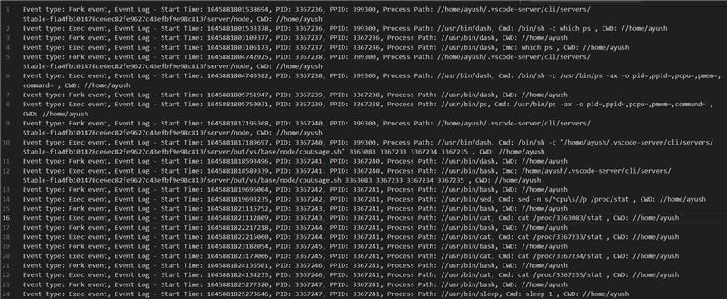

# ebpf-short-lived-processes-data-extraction
# eBPF Short-Lived Processes Data Extraction on Linux for Security Threat Analysis

This project provides a working solution for extracting data on short-lived processes using eBPF on Linux, aimed at enhancing security threat analysis.

## Installation

1. **Install Dependencies (Ubuntu):**
   ```sh
   sudo apt install clang libelf1 libelf-dev zlib1g-dev
2. **Build the project**
    sudo ./build.sh
2. **Run the program**
    sudo ./ebpf_prog_test

You should see output similar to the sample below.
